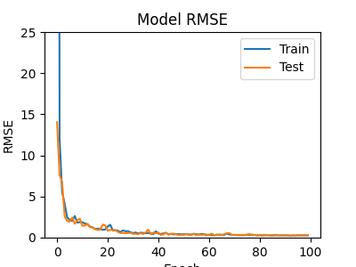

# 回帰でDropoutやBNを使ってはいけないという話を試してみた

## 元ネタ

- <https://twitter.com/Tsultra_K/status/1421057421527506944>
- <https://towardsdatascience.com/pitfalls-with-dropout-and-batchnorm-in-regression-problems-39e02ce08e4d>

## 個人的な見解・予想

- 片対数グラフは自分には解釈が難しすぎるのでやめて欲しい。ついでにMSEもRMSEにして欲しい。
- Dropoutはその後にDense1個とか通せば大数の法則的な事が起こってほぼ無視できると思っていたけど分散が平均のシフトに変換されると言われればそうなのかという気もしてきた。
- BNの話は急に説明がふわっとしてて理屈が分からない。
    - BNは外乱でもあるのでトイプロブレムでerrorが≒0まで下がることを阻害するという話ならあると思う。

## 実験条件

あまり細かく元ネタに合わせるつもりはなく、自分がやりそうな条件寄りで。

- batch_size = 16, steps_per_epoch = 16, epochs = 100
- targetは25～75[px]の一様分布。RMSEで評価。`<=1.0`くらいになってれば十分？
- flattenじゃなくgap。dropoutはgapの前に。denseは1個だけ。
- Adam+CosineDecay、L2 1e-4とか。

## 結果

### Dropout無し、BN無し

### Dropout

問題無さそう？
(Dropout→GAP→DenseではなくDropout→Dense→ReLUな場合にだけ問題になる？)

### BN

問題無さそう？ (途中一番苦労してそうな感じだけど)

## 結論

- 条件次第かもだけど大丈夫な場合も結構ありそうかも。
- だめな場合もLayerNormalization入れたら改善するとかもあるかも。(妄想)
